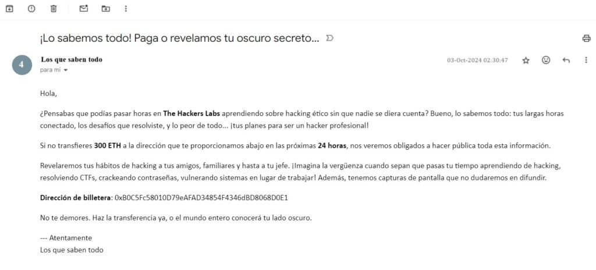

# 🔍 Writeup OSINT: !Atención extorsión¡

**Plataforma:** [The Hacker Labs](https://labs.thehackerslabs.com/)
**Dificultad:** 🟢 Principiante
**Categoría:** OSINT

---

## 📝 Descripción del Escenario
Estimados miembros de las FFCCSE,

Me dirijo a ustedes con un asunto de extrema gravedad que requiere su atención inmediata. He sido objeto de extorsión, donde se me ha exigido transferir 300 ETH a una dirección desconocida. El extorsionador amenaza con hacer pública mi interés por aprender hacking en The Hackers Labs, lo que podría tener serias repercusiones para mi reputación y seguridad.

A continuación, detallo los pasos que considero cruciales para abordar esta situación:

1. Identificación de la Transacción: Rastrear la transacción involucrada y recopilar información clave, incluyendo el valor transferido y las direcciones de envío y recepción.

2. Análisis de la Billetera Destinataria: Examinar la actividad de la billetera que ha recibido los fondos, buscando detectar posibles pagos o transacciones sospechosas que puedan estar         relacionadas con el extorsionador.

3. Informe de Resultados: Elaborar un informe detallado sobre los hallazgos de la investigación, con el objetivo de identificar y exponer al extorsionador. Este informe será fundamental para realizar la denuncia correspondiente.

En la captura de pantalla adjunta se encuentra la dirección de la billetera involucrada. Recomiendo que se copie esta información en un formato de texto, ya que es una captura de pantalla. Utilizar esta dirección será clave para resolver gran parte del problema. Agradezco de antemano su atención y apoyo en esta delicada situación.



---

## 🎯 Objetivos
- [X] ¿Cuál fue la cantidad exacta transferida?
- [X] ¿Cuál fue la dirección de envío?
- [X] ¿Cuál fue la dirección de recepción?
- [X] ¿Qué plataforma fue utilizada para la operación?
- [X] ¿En qué fecha y hora se realizó la operación?
- [X] ¿Cuál es el hash de la transacción?

---

## 🛠️ Herramientas Utilizadas
- **Google Lens / Yandex Images:** Para búsqueda visual inversa.
- **ExifTool:** Para extracción de metadatos de imágenes.
- **Google Maps / Street View:** Para confirmación de geolocalización.
- **Phonebook.cz / Intelligence X:** Para búsqueda de correos o dominios.

---

## 🕵️ Paso a Paso (Investigación)

### 1. Análisis Inicial de la Pista
Al descargar el archivo `pista.jpg`, lo primero que hice fue analizar visualmente la imagen. Observé un edificio con un logo peculiar y una matrícula de coche que parece ser de [País].

### 2. Extracción de Metadatos (Metadata Analysis)
Ejecuté `exiftool` para ver si la imagen contenía coordenadas GPS o información del dispositivo:
```bash
exiftool pista.jpg